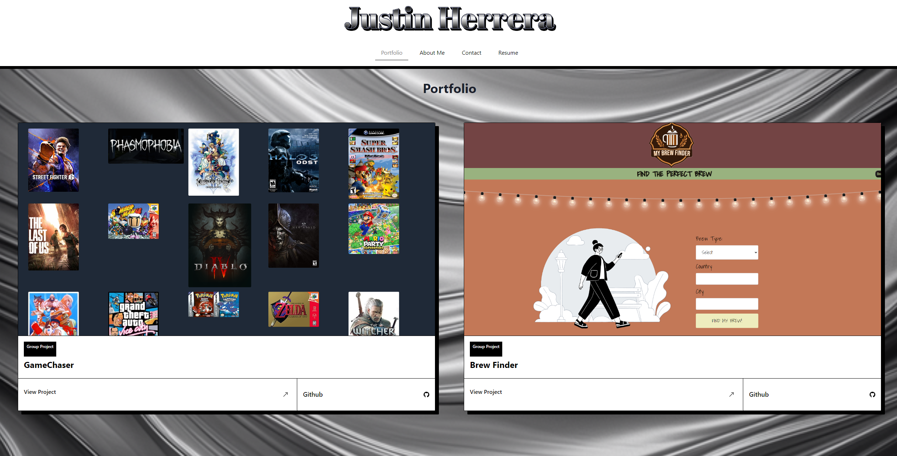

# React-Portfolio

Welcome to my professional portfolio—a dynamic single-page application designed to highlight my evolution and accomplishments as an emerging web developer. This site not only presents my professional journey but also serves as a testament to my technical proficiency, leveraging cutting-edge web technologies.

Key Features:

- Intuitive Navigation: At the top, you'll find my name alongside a responsive navigation menu that adapts fluidly to various screen sizes. This menu guides you through the core sections: About Me, Portfolio, Contact, and Resume, with visual cues indicating your current location within the site.
- Seamless User Experience: As you explore different sections, content updates smoothly below the header, with the URL dynamically reflecting your current position within the portfolio.
- Project Showcase: Peruse a curated collection of my work, where each project is represented by a visual preview and accompanied by direct links to both the live application and its GitHub repository.
- Easy Communication: Reach out effortlessly through a streamlined contact form, designed with user experience in mind.
- Professional Overview: The resume section offers a comprehensive look at my technical skill set and areas of expertise.
- Connect with Ease: In the footer, you'll discover quick links to my professional profiles on GitHub, LinkedIn, and Stack Overflow, as well as a direct email link. Consider it your digital gateway to connect with me through your preferred platform.

This portfolio is more than just a showcase—it's an interactive demonstration of my capabilities as a web developer, inviting you to explore my work and connect with me professionally.

## Installation

To install React-Portfolio:

- Clone the repository: `https://github.com/Justino11247/React-Portfolio`

- Go to the project directory

- Launch the terminal and install the dependencies by executing the following command: `npm install`

## Usage

- Start the application, in the terminal by executing the following command: `npm run dev`

- You will be redirected to the application: `http://localhost:3000/`
 

[Link to Deployed Application](https://main--justins-react-portfolio.netlify.app/)

